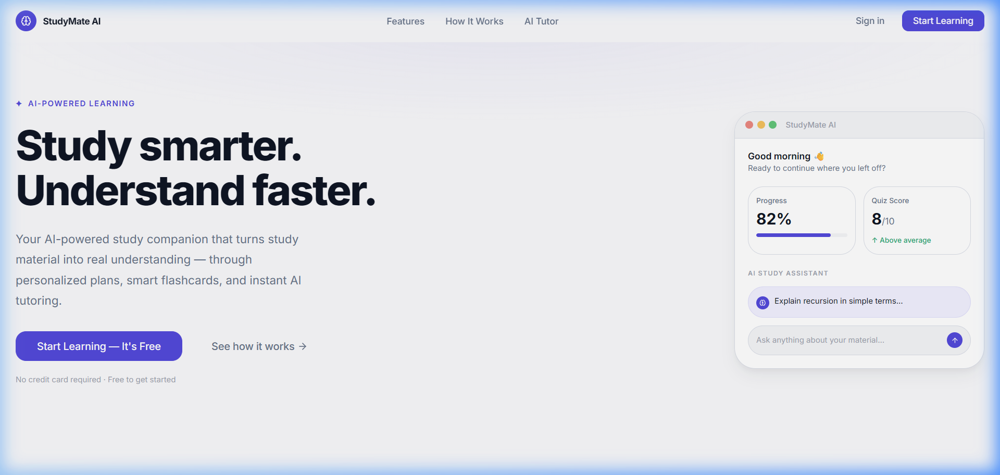
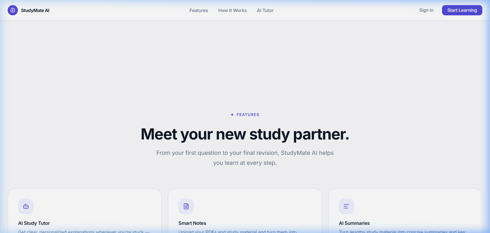
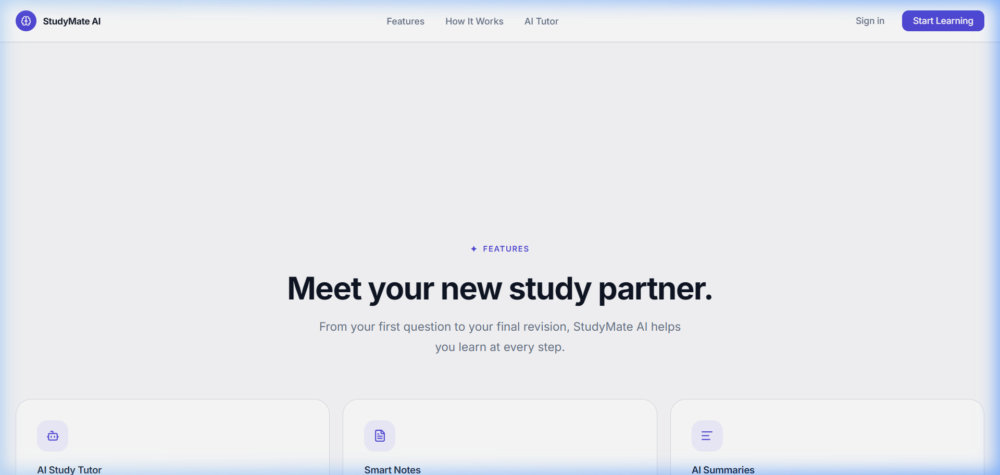

# StudyMate AI

### Your AI-powered study companion

StudyMate AI is a frontend product concept designed to help students understand, practice, and improve their learning through structured, AI-powered study workflows. It transforms course materials (lecture notes, textbook PDFs) into interactive explanations, smart flashcards, practice quizzes, and actionable progress tracking.

---

## ✨ Features

- **AI Study Tutor**: Receive clear, conversational explanations with conceptual breakdowns whenever you get stuck on difficult topics.
- **Smart Notes**: Upload and organize course PDFs into searchable, structured study notes.
- **AI Summaries**: Condense long readings into focused, 2-minute key takeaways and concept bullet points.
- **AI Quiz Generator**: Generate targeted multiple-choice practice questions directly from your notes to test active recall.
- **AI Flashcards**: Create bite-sized revision cards for active spaced repetition.
- **Study Progress**: Track subject mastery, identify weak topics, and prioritize what to revise next.

---

## 🎯 Product Journey

StudyMate AI structures studying into a natural four-stage workflow:

```
UPLOAD ──► UNDERSTAND ──► PRACTICE ──► IMPROVE
```

1. **Upload**: Bring your raw materials (PDFs, class notes, lecture slides).
2. **Understand**: Break down complex concepts with the AI tutor and summarized takeaways.
3. **Practice**: Test active recall using custom-generated quizzes and flashcards.
4. **Improve**: Analyze topic mastery to focus future revision where it matters most.

---

## 🖥️ Screenshots

### Hero
*Above-the-fold value proposition with real dashboard product preview.*



### Product Showcase
*Interactive tabbed product preview demonstrating Overview, AI Tutor, Notes, and Quiz tabs.*



### Core Features
*Structured 6-card feature grid with interactive micro-demonstrations.*



### Mobile Experience
*Responsive 390px mobile layout with full touch-friendly navigation and zero horizontal overflow.*


---

## 🛠️ Tech Stack

- **Framework**: [React 19](https://react.dev/) + [Vite 8](https://vite.dev/)
- **Styling**: [Tailwind CSS v4](https://tailwindcss.com/) (using native `@theme` CSS tokens)
- **Icons**: [Lucide React](https://lucide.dev/)
- **Motion**: [Framer Motion](https://www.framer.com/motion/)

---

## 📁 Project Structure

```
studymate-ai/
├── public/
│   ├── favicon.svg
│   └── screenshots/
├── src/
│   ├── components/
│   │   ├── common/          # Reusable UI primitives (Button, Card, Badge, SectionLabel)
│   │   ├── feature/         # Feature cards & interactive visual demos
│   │   ├── how-it-works/    # Journey step wrappers & preview panels
│   │   ├── layout/          # Layout & footer components
│   │   ├── product-preview/ # Showcase tabs & workspace panels (Tutor, Quiz, Notes)
│   │   └── trust/           # Capability strip, principles & workspace hub
│   ├── data/                # Static data & navigation link definitions
│   ├── hooks/               # Custom hooks (e.g. useIntersection with reduced-motion support)
│   ├── lib/                 # Shared utilities
│   ├── pages/               # Page assembly (HomePage)
│   ├── sections/            # Section components (Navbar, Hero, Showcase, Features, etc.)
│   ├── App.jsx
│   ├── index.css            # Design tokens, typography hierarchy & custom classes
│   └── main.jsx
├── DECISIONS.md             # Engineering rationale & architectural decisions
├── package.json
└── vite.config.js
```

---

## 🚀 Getting Started

### Prerequisites
- Node.js (v18 or higher recommended)
- npm

### Installation & Local Run

```bash
# Clone the repository
git clone https://github.com/Prabhat1522/StudyMate-AI.git

# Navigate into the project directory
cd StudyMate-AI

# Install dependencies
npm install

# Start the Vite development server
npm run dev
```

The application will be running locally at `http://localhost:5173`.

---

## 📦 Production Build

To compile a minified production bundle into the `dist/` folder:

```bash
npm run build
```

To preview the production bundle locally:

```bash
npm run preview
```

---

## 📱 Responsive Design

The homepage layout was verified across multiple screen widths:
- **390px (Mobile)**: Single-column stack, accessible hamburger menu, full touch targets, zero horizontal scrolling.
- **768px (Tablet)**: Balanced 2-column feature and footer grids.
- **1024px / 1440px (Desktop)**: Centered max-width container, interactive tabs, 3-column workspace diagrams.

---

## ♿ Accessibility

- Semantic HTML landmark elements (`<header>`, `<nav>`, `<main>`, `<section>`, `<footer>`, `<article>`).
- Full keyboard navigability with visible `:focus-visible` styling.
- ARIA attributes for tab lists (`role="tablist"`, `role="tab"`, `aria-selected`, `aria-controls`).
- Color contrast meeting WCAG AA standards.
- Automatic respect for `prefers-reduced-motion` to disable non-essential animations.

---

## 🤖 AI-Assisted Development

AI tools were utilized during development for project scaffolding, initial component boilerplates, and layout suggestions. All code was subsequently reviewed, manually refined, tested across breakpoints, and verified for production readiness.

---

## 📌 Project Status

**Frontend Product Concept** — Built as a frontend engineering challenge submission.

---

## 📄 Engineering Decisions

For detailed explanations of product trade-offs, architecture choices, and verification logs, read [DECISIONS.md](./DECISIONS.md).

---

## 📜 License

This project was created as part of a frontend engineering challenge. All rights reserved.
